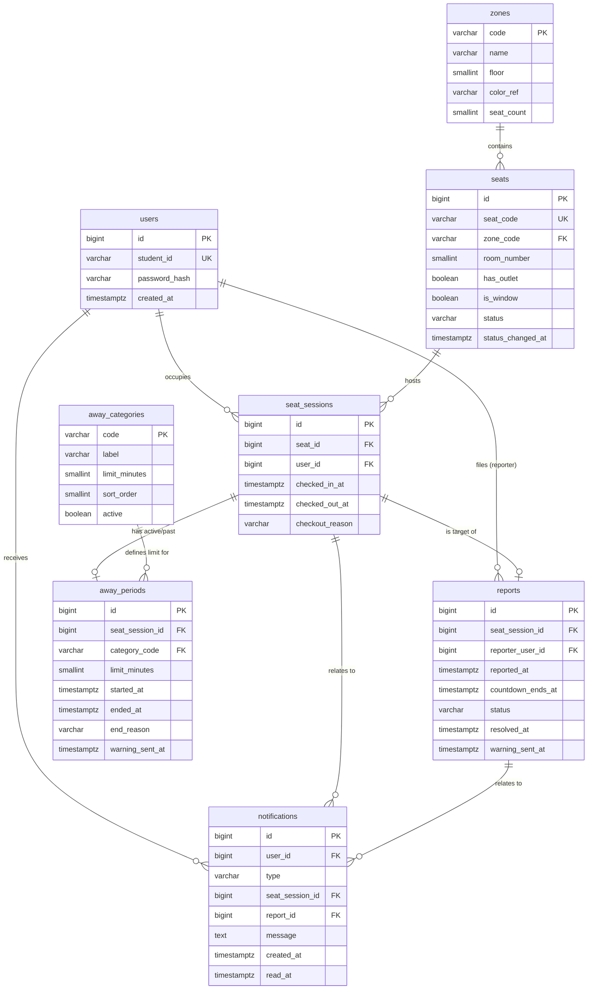

# DB.md: 자리지킴이 데이터베이스 설계

- 문서 상태: Draft v1.2 (실제 9개 구역 데이터로 갱신, 좌석 수 TBD, 2026-07-17)
- 작성일: 2026-07-17
- 기반 문서: `PRD.md` (Draft v1.3)
- DB 엔진 가정: PostgreSQL (Next.js 구현 예정 및 Supabase 연동 가능성을 고려한 기본 선택. 다른 RDBMS 채택 시 ENUM/부분 인덱스 문법만 치환하면 됨)
- 본 문서는 스키마(테이블·컬럼·제약조건·관계)만 다룬다. 화면 레이아웃은 `design.md`, 기능 요구사항의 배경은 `PRD.md` 소관.

---

## 0. 설계 원칙

1. **PRD의 "가정"을 스키마 제약조건으로 강제한다.** 예: 1인 1좌석(F3), 좌석당 활성 신고 1건(F13) 같은 규칙은 애플리케이션 코드가 아니라 DB의 부분 유니크 인덱스로 강제해 동시성 문제(9.2 NFR)를 원천 차단한다.
2. **코드 테이블은 실제로 코드 테이블로 만든다.** 자리비움 카테고리(F5, 10.1)는 하드코딩 ENUM이 아니라 데이터 행으로 관리해, PRD가 요구한 "배포 없는 확장성"을 충족한다.
3. **신원 비노출(F14)은 스키마 레벨에서 완전히 보장할 수 없다.** DB는 "어떤 컬럼이 민감한지"만 표시하고, 실제 비노출 보장은 API/서비스 레이어의 책임이다. 이 경계를 문서에 명시적으로 표시한다.
4. **별도의 "감사 로그" 테이블을 새로 만들지 않는다.** `seat_sessions` / `away_periods` / `reports`가 그 자체로 이력이자 감사 대상이므로, 중복 저장 대신 이 테이블들에 보관 기간·익명화 정책을 적용하는 방식을 택했다 (근거는 5절 참고).

---

## 1. ERD 개요



---

## 2. 테이블 정의

### 2.1 `users` — 이용자 계정 (근거: F1, 14.1)

| 컬럼 | 타입 | 제약조건 | 설명 |
|---|---|---|---|
| id | BIGSERIAL | PK | |
| student_id | VARCHAR(20) | UNIQUE, NOT NULL | 학번. 자체 회원가입 기반 로그인 식별자(14.1 — SSO 미연동 확정) |
| password_hash | VARCHAR(255) | NOT NULL | 해시 저장(bcrypt 등 알고리즘 선택은 구현 단계 사항) |
| created_at | TIMESTAMPTZ | NOT NULL DEFAULT now() | |

> **가정**: PRD는 표시 이름(닉네임 등)을 요구하지 않으므로 넣지 않았다. 필요해지면 이후에 컬럼 추가.

### 2.2 `zones` — 구역 (근거: 6.2. 2026-07-17 실제 2~5층 방 구조로 재설계, 같은 날 더 상세한 2F~5F.png 반영해 24개로 확장)

| 컬럼 | 타입 | 제약조건 | 설명 |
|---|---|---|---|
| code | VARCHAR(4) | PK | 24개 (2.2절 시드 데이터 참고) |
| name | VARCHAR(50) | NOT NULL | 예: "제1자유열람실" |
| floor | SMALLINT | NOT NULL | 2~5 (5층 `F4F2` 제2자유열람실은 4층에서 이어지는 복층이라 별도 구역 코드 없이 같은 코드를 씀) |
| color_ref | VARCHAR(20) | NOT NULL | 참고 색상 식별자. 실제 팔레트는 `design.md` 소관 |
| description | TEXT | NULL | 성격(소음/이용목적) 메모 — 실제 방별 운영 규정 확정 전이라 현재 전부 NULL(TBD) |
| seat_count | SMALLINT | NOT NULL | 6.2 표의 공식 좌석 수 (정합성 검증용 — `seats` 실카운트와 반드시 일치해야 함). 실제 좌석 배치 확정 전이라 현재 전부 0 |

**시드 데이터** (2026-07-17 기준, 2F.png~5F.png 실측 층별 안내도 범례 1~8번 기준. 화장실/엘리베이터/비상계단 등 시설 아이콘은 구역이 아니므로 제외. 좌석 배치는 TBD — 구역만 우선 반영):

```sql
INSERT INTO zones (code, name, floor, color_ref, description, seat_count) VALUES
('F2F1', '제1자유열람실',             2, 'coral',   NULL, 0),
('F2SQ', '메인스퀘어',               2, 'teal',    NULL, 0),
('F2LB', '메인로비',                 2, 'slate',   NULL, 0),
('F2CF', '컨퍼런스룸',               2, 'indigo',  NULL, 0),
('F2MD', '미디어실',                 2, 'cyan',    NULL, 0),
('F2LK', '락커룸',                   2, 'amber',   NULL, 0),
('F2RS', '휴게실',                   2, 'lime',    NULL, 0),
('F2CE', '카페',                     2, 'brown',   NULL, 0),
('F3R1', '제1자료실',                3, 'blue',    NULL, 0),
('F3R2', '제2자료실',                3, 'navy',    NULL, 0),
('F3AR', '수서/정리실',              3, 'sky',     NULL, 0),
('F3RC', '학술정보운영팀(리서치커먼스)', 3, 'violet', NULL, 0),
('F3DR', '도서관장실',               3, 'rose',    NULL, 0),
('F3LN', '대출실',                   3, 'emerald', NULL, 0),
('F3MT', '회의실',                   3, 'fuchsia', NULL, 0),
('F3SC', '악보서가',                 3, 'orange',  NULL, 0),
('F4F2', '제2자유열람실',             4, 'green',   NULL, 0),
('F4GR', '대학원 열람실',             4, 'purple',  NULL, 0),
('F4CR', '1인 연구 캐럴',             4, 'yellow',  NULL, 0),
('F4FT', '미래인재양성센터',          4, 'pink',    NULL, 0),
('F4SM', '대학원세미나실',            4, 'teal',    NULL, 0),
('F4RS', '휴게실',                   4, 'lime',    NULL, 0),
('F5ED', '학술정보이용교육실',        5, 'indigo',  NULL, 0),
('F5EX', '고시반',                   5, 'rose',    NULL, 0);
```

> 좌석 수(seat_count)가 전부 0인 것은 임시값이 아니라 **현재 실측이 안 된 상태를 그대로 반영한 것**이다. 실측되는 대로 각 행의 `seat_count`를 갱신하고, `seats` 테이블에 해당 개수만큼 좌석을 추가하면 된다(3절 정합성 체크 쿼리로 항상 일치 여부 확인 가능).

### 2.3 `seats` — 좌석 (근거: 6.2, 6.3, 7.1)

| 컬럼 | 타입 | 제약조건 | 설명 |
|---|---|---|---|
| id | BIGSERIAL | PK | |
| seat_code | VARCHAR(20) | UNIQUE, NOT NULL | `{zone_code}-{3자리 일련번호}` (예: `F2F1-001`) |
| zone_code | VARCHAR(4) | NOT NULL, FK → zones(code) | |
| room_number | SMALLINT | NULL | 방 단위로 그룹핑되는 구역이 있을 때만 사용. **현재 9개 구역 중 해당하는 곳 없음** — 전부 NULL |
| has_outlet | BOOLEAN | NOT NULL DEFAULT FALSE | 구역별 콘센트 보유 여부는 실측 필요(TBD) |
| is_window | BOOLEAN | NOT NULL DEFAULT FALSE | |
| status | VARCHAR(10) | NOT NULL DEFAULT 'AVAILABLE', CHECK IN ('AVAILABLE','OCCUPIED') | 7.1의 2대 상태. **비정규화 캐시** — 아래 4절 참고. (2026-07-17: 5분 buffer 전환 상태였던 `EMPTY`는 폐기, `AVAILABLE`에 흡수) |
| status_changed_at | TIMESTAMPTZ | NOT NULL DEFAULT now() | 좌석 상태가 마지막으로 바뀐 시각(일반 부기용) |

- **`room_number`(구 GS 방식)**: 방 단위로 그룹핑되는 구역이 생기면 그 구역 좌석에만 값을 채우는 용도로 남겨둔 컬럼이다. 2026-07-17 기준 실제 9개 구역 중에는 해당하는 곳이 없어 전부 NULL이다. 필요해지면 예약 단위를 승격하는 대신(이전 GS 결정과 동일하게) 조회 편의 속성으로만 쓰는 것을 권장.
- **"이용중 - 재실/외출" 구분(7.2)**: `seats.status`에는 별도로 저장하지 않는다. `OCCUPIED`인 좌석에 대해 활성 `away_periods` 레코드가 있으면 "외출", 없으면 "재실"로 애플리케이션이 판단한다. 상태를 이중으로 저장하면 동기화 버그(하나만 갱신되고 다른 하나는 안 갱신)가 생기기 쉬워, 단일 소스(활성 away_periods 유무)로 판단하도록 설계했다.

### 2.4 `away_categories` — 자리비움 카테고리 코드 테이블 (근거: F5, 10.1, 10.2)

| 컬럼 | 타입 | 제약조건 | 설명 |
|---|---|---|---|
| code | VARCHAR(20) | PK | `TOILET`/`CAFE`/`CONVENIENCE`/`MEAL`/`MEETING` |
| label | VARCHAR(30) | NOT NULL | 화면 표시명(예: "화장실") |
| limit_minutes | SMALLINT | NOT NULL, CHECK (limit_minutes > 0 AND limit_minutes <= 90) | v1 상한 90분(F5) |
| sort_order | SMALLINT | NOT NULL | UI 노출 순서 |
| active | BOOLEAN | NOT NULL DEFAULT TRUE | 비활성화 시 신규 신청만 차단, 과거 이력은 유지 |

**시드 데이터** (10.2절 그대로):

```sql
INSERT INTO away_categories (code, label, limit_minutes, sort_order, active) VALUES
('TOILET',      '화장실', 10, 1, TRUE),
('CAFE',        '카페',   20, 2, TRUE),
('CONVENIENCE', '편의점', 20, 3, TRUE),
('MEAL',        '식사',   60, 4, TRUE),
('MEETING',     '회의',   90, 5, TRUE);
```

### 2.5 `seat_sessions` — 체크인 세션 (근거: F3, F4, 8절 시나리오 1)

한 번의 "체크인 ~ 체크아웃"을 나타내는 핵심 트랜잭션 테이블. 좌석 이용 이력(F20 후보)의 원천 데이터이기도 하다.

| 컬럼 | 타입 | 제약조건 | 설명 |
|---|---|---|---|
| id | BIGSERIAL | PK | |
| seat_id | BIGINT | NOT NULL, FK → seats(id) | |
| user_id | BIGINT | NOT NULL, FK → users(id) | |
| checked_in_at | TIMESTAMPTZ | NOT NULL DEFAULT now() | |
| checked_out_at | TIMESTAMPTZ | NULL | NULL이면 현재 활성 세션 |
| checkout_reason | VARCHAR(20) | NULL, CHECK IN ('MANUAL','AWAY_EXPIRED','REPORT_EXPIRED') | 체크아웃 완료 시점에만 값이 채워짐 |

**동시성 제약 (9.2 NFR 직접 대응):**

```sql
-- 좌석당 활성 세션은 1개뿐 (동시 체크인 방지)
CREATE UNIQUE INDEX ux_seat_sessions_active_seat
  ON seat_sessions (seat_id) WHERE checked_out_at IS NULL;

-- 이용자당 활성 세션은 1개뿐 (F3: 1인 1좌석)
CREATE UNIQUE INDEX ux_seat_sessions_active_user
  ON seat_sessions (user_id) WHERE checked_out_at IS NULL;
```

### 2.6 `away_periods` — 자리비움 기록 (근거: F5~F8, 시나리오 2·3·7)

| 컬럼 | 타입 | 제약조건 | 설명 |
|---|---|---|---|
| id | BIGSERIAL | PK | |
| seat_session_id | BIGINT | NOT NULL, FK → seat_sessions(id) | 어떤 체크인 세션 중 발생한 자리비움인지 |
| category_code | VARCHAR(20) | NOT NULL, FK → away_categories(code) | |
| limit_minutes | SMALLINT | NOT NULL | **신청 시점 값 스냅샷**(카테고리 제한시간이 나중에 바뀌어도 과거 기록은 불변) |
| started_at | TIMESTAMPTZ | NOT NULL DEFAULT now() | |
| ended_at | TIMESTAMPTZ | NULL | NULL이면 현재 진행 중 |
| end_reason | VARCHAR(20) | NULL, CHECK IN ('RETURNED','AUTO_EXPIRED','SESSION_CHECKOUT') | `SESSION_CHECKOUT`은 외출 중 본인이 그대로 체크아웃해버린 예외 케이스 |
| warning_sent_at | TIMESTAMPTZ | NULL | 20% 경고 알림(10.3) 중복 발송 방지용 |

```sql
-- 세션당 활성 자리비움은 1개뿐
CREATE UNIQUE INDEX ux_away_periods_active_session
  ON away_periods (seat_session_id) WHERE ended_at IS NULL;
```

**쿨다운(F8, 10.4) 계산 방법**: 별도 테이블 없이, 해당 `user_id`의 가장 최근 종료된 `away_periods.ended_at`을 조회해 `now() - ended_at < 30분`이면 신청을 거부한다.

> **가정(명시)**: PRD F8은 "동일 이용자" 기준으로 쿨다운을 규정하므로, 쿨다운은 좌석이 아닌 **이용자 단위**로 계산한다(현재 세션의 `user_id` 기준으로 그 이용자의 모든 과거 세션에 걸친 최근 자리비움 종료 시각을 본다). 이용자가 체크아웃 후 곧바로 다른 좌석에 체크인하는 극단적 케이스에도 쿨다운이 이월되도록 설계했다 — PRD에 명시되지 않은 엣지 케이스라 팀 논의로 재확인 필요.

### 2.7 `reports` — 무단 점유 신고 (근거: F9~F14, 시나리오 4~6·8)

| 컬럼 | 타입 | 제약조건 | 설명 |
|---|---|---|---|
| id | BIGSERIAL | PK | |
| seat_session_id | BIGINT | NOT NULL, FK → seat_sessions(id) | 피신고자 = 이 세션의 `user_id` (좌석이 아니라 **세션**에 연결해, 신고 처리 중 좌석이 반납·재점유되어도 오귀속되지 않도록 함) |
| reporter_user_id | BIGINT | NOT NULL, FK → users(id) | **민감 컬럼 — 절대 어떤 API 응답/알림 payload에도 조인해 노출 금지**(F14, 9.2 익명성 NFR) |
| reported_at | TIMESTAMPTZ | NOT NULL DEFAULT now() | |
| countdown_ends_at | TIMESTAMPTZ | NOT NULL | `reported_at + 60분` |
| status | VARCHAR(20) | NOT NULL DEFAULT 'ACTIVE', CHECK IN ('ACTIVE','CANCELLED_RETURN','AUTO_EXPIRED') | |
| resolved_at | TIMESTAMPTZ | NULL | 취소 또는 자동반납이 확정된 시각 |
| warning_sent_at | TIMESTAMPTZ | NULL | 60분 중 20%(잔여 12분) 경고 알림(10.3) 중복 발송 방지용 |

```sql
-- 세션당 활성 신고는 1건뿐 (F13)
CREATE UNIQUE INDEX ux_reports_active_session
  ON reports (seat_session_id) WHERE status = 'ACTIVE';
```

이 유니크 인덱스 하나로 F13("이미 신고 접수됨" 거부, 카운트다운 갱신 안 됨)이 DB 레벨에서 자동으로 보장된다 — 두 번째 신고 INSERT는 제약 위반으로 실패하고, 애플리케이션은 이를 잡아 "이미 신고 접수된 좌석입니다" 응답만 내려주면 된다. 중복 시도 자체는 F13이 요구하는 대로 애플리케이션 레벨에서 별도 로그(예: 구조화 로그 시스템)로 남긴다 — DB 테이블로 적재하지 않는 이유는 이 값이 감사/법적 보관 대상이 아니라 순수 운영 모니터링용이기 때문이다.

### 2.8 `notifications` — 알림 (근거: F16, 14.7)

| 컬럼 | 타입 | 제약조건 | 설명 |
|---|---|---|---|
| id | BIGSERIAL | PK | |
| user_id | BIGINT | NOT NULL, FK → users(id) | 수신자 |
| type | VARCHAR(30) | NOT NULL, CHECK IN (아래 목록) | |
| seat_session_id | BIGINT | NULL, FK → seat_sessions(id) | |
| report_id | BIGINT | NULL, FK → reports(id) | |
| message | TEXT | NOT NULL | 렌더링된 최종 문구. **상대방 식별정보 절대 포함 금지**(F14) — 이 컬럼에 무엇을 넣을지는 서비스 레이어가 책임짐 |
| created_at | TIMESTAMPTZ | NOT NULL DEFAULT now() | |
| read_at | TIMESTAMPTZ | NULL | |

**`type` 허용값** (F16 매핑):

| type | 발생 시점 | 수신자 |
|---|---|---|
| `CHECKIN_COMPLETE` | 체크인 성공 | 본인 |
| `CHECKOUT_COMPLETE` | 체크아웃 성공 | 본인 |
| `AWAY_STARTED` | 자리비움 신청 성공(잔여시간 안내) | 본인 |
| `AWAY_WARNING` | 자리비움 잔여 20% 도달 | 본인 |
| `AWAY_AUTO_EXPIRED` | 자리비움 제한시간 초과 자동반납 (소지품 안내 문구 포함, 14.7) | 본인 |
| `REPORT_RECEIVED` | 신고 접수 (익명) | 피신고자 |
| `REPORT_WARNING` | 신고 카운트다운 잔여 20% 도달 | 피신고자 |
| `REPORT_AUTO_EXPIRED_OCCUPANT` | 신고로 인한 자동반납 (소지품 안내 문구 포함, 14.7) | 피신고자 |
| `REPORT_AUTO_EXPIRED_REPORTER` | 신고로 인한 자동반납 (좌석 이용 가능 안내) | 신고자 |
| `REPORT_CANCELLED` | 피신고자 복귀로 신고 취소 (익명) | 신고자 |
| `REPORT_CHECKED_OUT` | 신고 처리 팝업에서 피신고자가 "자리 복귀" 대신 체크아웃을 선택 | 신고자 |
| `SEAT_WATCH_AVAILABLE` | "체크아웃 시 알림"을 신청한 좌석이 실제로 체크아웃됨(F22, 2.9절) | 알림 신청자 |

> F8의 쿨다운 거부 안내는 **알림이 아니라 신청 요청에 대한 동기(synchronous) 응답**으로 처리한다(비동기로 저장할 이유가 없는 즉각적 UI 피드백이므로 `notifications`에 넣지 않았다).

### 2.9 `seat_watch_requests` — "체크아웃 시 알림" 구독 (근거: F22)

이용 중(외출 포함)인 좌석 상세에서 "체크아웃 시 알림"을 누르면 그 시점의 활성 `seat_sessions` 행을 대상으로 구독을 남긴다. 그 세션이 실제로 체크아웃되면(수동 체크아웃/자리비움 자동반납/신고 자동반납 3개 경로 전부) 구독자에게 `SEAT_WATCH_AVAILABLE` 알림을 보내고 `notified_at`을 채운다.

| 컬럼 | 타입 | 제약조건 | 설명 |
|---|---|---|---|
| id | BIGSERIAL | PK | |
| seat_session_id | BIGINT | NOT NULL, FK → seat_sessions(id) | 구독 대상 세션(신청 시점의 활성 세션) |
| watcher_user_id | BIGINT | NOT NULL, FK → users(id) | 구독한 이용자 |
| created_at | TIMESTAMPTZ | NOT NULL DEFAULT now() | |
| notified_at | TIMESTAMPTZ | NULL | 알림 발송 시각. NULL이면 아직 미발송(=대상 세션이 아직 체크아웃 안 됨) |

> UNIQUE(seat_session_id, watcher_user_id) — 같은 세션에 같은 사용자가 중복 구독해도 1건만 유지(재신청은 idempotent). 본인 좌석 구독은 API 레이어에서 거부한다.

---

## 3. 좌석 수 정합성 체크

```sql
SELECT z.code, z.seat_count AS expected, COUNT(s.id) AS actual
FROM zones z LEFT JOIN seats s ON s.zone_code = z.code
GROUP BY z.code, z.seat_count
HAVING z.seat_count <> COUNT(s.id);
-- 결과가 0행이어야 6.2절 좌석 수(현재 전 구역 0석, TBD)와 실제 시드 데이터가 일치함
```

---

## 4. 좌석 상태(`seats.status`) 동기화 방식

`seats.status`는 조회 성능(9.2 실시간성 NFR — 매번 세션/신고/자리비움 테이블을 조인하지 않고 좌석 맵을 즉시 렌더링하기 위한 캐시)을 위해 비정규화된 컬럼이다. 진실의 원천은 `seat_sessions`(활성 세션 유무)이며, `seats.status`는 아래 이벤트가 발생할 때마다 같은 트랜잭션 안에서 갱신되어야 한다.

| 이벤트 | status 전이 |
|---|---|
| 체크인 성공 | → `OCCUPIED` |
| 체크아웃(수동/자동/신고반납) | → `AVAILABLE` (+ `status_changed_at = now()`), 지연 없이 즉시 반영 |

> **폐기된 설계(2026-07-17)**: 이전 버전은 체크아웃 시 `EMPTY`로 전이했다가 5분 buffer 후 `AVAILABLE`로 넘어가는 3단계 상태 머신이었다. "빈자리" 표시 상태 자체를 폐기하기로 확정하면서(PRD 7.1) 더 이상 필요 없어졌고, `SeatStatus` enum도 `AVAILABLE`/`OCCUPIED` 2개 값으로 줄었다(Postgres enum은 값을 직접 DROP할 수 없어 rename-recreate-cast 마이그레이션으로 적용).

실시간 동기화 기술(폴링/웹소켓/SSE)은 13절 리스크에 따라 여전히 미확정이지만, 이 스키마는 어느 방식을 택하든 그대로 사용 가능하다(상태를 갱신하는 쪽이 DB고, 그 변경을 클라이언트에 전파하는 방식만 달라짐).

---

## 5. 감사 로그 / 익명성 보관 정책 (근거: 9.2, F14, 14.6)

별도의 `audit_logs` 테이블을 두지 않고, `reports`가 그 자체로 "신고자-피신고자 매핑" 감사 대상이다. 14.6에서 확정한 **90일 보관** 정책은 아래와 같이 적용한다.

- **보관 시작 기준**: `reports.resolved_at` (신고가 취소/자동반납으로 종결된 시각)
- **90일 경과 후 처리**: `reports.reporter_user_id`를 `NULL`로 익명화하는 배치 잡을 둔다 (레코드 자체는 통계 집계용으로 남기되, 매핑 정보만 제거). 예:

```sql
UPDATE reports
SET reporter_user_id = NULL
WHERE resolved_at < now() - INTERVAL '90 days'
  AND reporter_user_id IS NOT NULL;
```

- **접근 권한**: `reporter_user_id`를 조회할 수 있는 쿼리 경로는 운영자 전용 관리 기능에서만 열어야 한다(일반 이용자 API는 해당 컬럼을 절대 SELECT하지 않는 뷰/쿼리만 사용). 세부 권한 관리 절차(운영자 역할 테이블 등)는 14.6에서 명시한 대로 v1 이후 별도 정의 대상이며, 본 스키마는 `users` 테이블에 역할(role) 컬럼을 아직 두지 않았다 — 운영자 조회 화면(F19)을 구현할 때 `users.role` 또는 별도 `admin_users` 테이블 추가가 필요하다(오픈 이슈로 남김).
- `seat_sessions`/`away_periods`는 이용자 본인의 행동 기록이라 F14의 "상호 익명성" 대상이 아니므로 별도 익명화 없이 이력(F20 후보)으로 계속 보관한다.

---

## 6. 요구사항 ↔ 스키마 추적표

| PRD 요구사항 | 대응 테이블/컬럼 |
|---|---|
| F1 (계정 로그인, 14.1) | `users` |
| F2 (좌석 맵 실시간 상태) | `seats.status`, `away_periods`(활성 여부로 외출 배지 판단) |
| F3 (1인 1좌석) | `seat_sessions` 부분 유니크 인덱스(user_id) |
| F4 (체크아웃) | `seat_sessions.checked_out_at` |
| F5 (자리비움 카테고리, 10.1/10.2) | `away_categories`, `away_periods.category_code/limit_minutes` |
| F6 (자동반납) | `away_periods.end_reason = 'AUTO_EXPIRED'`, `seat_sessions.checkout_reason` |
| F7 (외출 배지, 잔여시간 비공개) | `away_periods` (본인 조회 시에만 category/잔여시간 계산해 반환) |
| F8 (쿨다운, 10.4) | `away_periods.ended_at` 기준 계산 (2.6절 가정 참고) |
| F9~F13 (신고 흐름) | `reports` + 부분 유니크 인덱스(seat_session_id) |
| F14 (익명성) | `reports.reporter_user_id` 접근 제한, `notifications.message` |
| F15 (대시보드 집계) | `seats.status` GROUP BY `zone_code` |
| F16 (알림 유형, 14.7) | `notifications.type` |
| 9.2 동시성 | 2.5/2.6/2.7절 부분 유니크 인덱스 3종 |
| 9.2 익명성 보안 | 5절 |
| 9.2 감사 로그 (14.6) | 5절 |
| 9.2 확장성(카테고리) | `away_categories` 코드 테이블 |
| 방 단위 그룹핑 대비 | `seats.room_number` (현재 사용하는 구역 없음, 향후 확장 여지만 남김) |

---

## 7. v1 스키마에 포함하지 않은 것

- 운영자 권한/역할 테이블 (F19 구현 시 추가 필요, 5절 오픈 이슈)
- 좌석 필터·통계용 파생 테이블(F17, F20, F21) — v1 Could 요구사항이며, 기존 테이블 쿼리로 충분히 커버 가능해 별도 테이블 없이 시작
- "방" 단위 엔티티 — 2026-07-17 기준 실제 9개 구역 중 방 단위 그룹핑이 필요한 곳이 없어 별도 테이블 없이 시작. 그런 구역이 추가되면 `seats.room_number`를 채우는 정도로 대응하고, 예약 단위 승격이 필요해지면 그때 테이블을 추가
