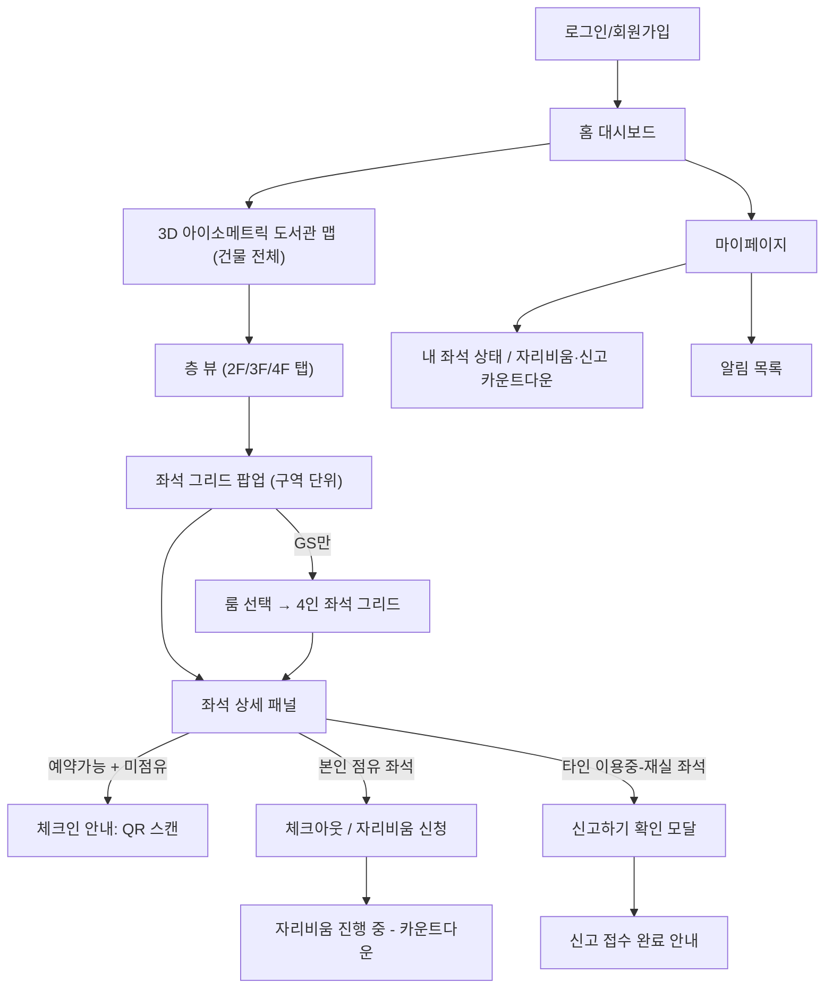

# design.md: 자리지킴이 화면·비주얼 디자인

- 문서 상태: Draft v1.2 (실제 9개 구역으로 색상표 갱신, 구역별 좌석 수 TBD, 2026-07-17)
- 작성일: 2026-07-17
- 기반 문서: `PRD.md` (Draft v1.3) — 기능·정보 구조의 근거는 전부 PRD를 따른다. 본 문서는 그 정보 구조를 **어떤 화면과 시각 언어로 보여줄 것인가**만 다룬다.
- 관련 문서: `DB.md` (데이터 구조 — 좌석 상태값 2종, 자리비움/신고 라이프사이클 등 본 문서가 시각화하는 상태 값의 출처)
- 대상: 반응형 웹, Next.js 구현 예정

---

## 0. 범위와 원칙

PRD 6절/7절이 이미 "9개 구역(좌석 수 TBD)", "좌석 상태 2종 + 이용중 하위 배지 2종"이라는 정보 구조를 확정해뒀다. 이 문서는 그 위에 다음 3가지만 새로 결정한다.

1. **실제 컬러 팔레트 확정** — PRD 6.2절의 "참고 색상"(코랄/슬레이트/틸/블루/네이비/옐로우/그린/핑크/퍼플)을 실제 토큰 값으로 확정
2. **3D 아이소메트릭 공간 맵**의 구조와 인터랙션 (건물 전체 → 층 → 구역 → 좌석 grid로 이어지는 드릴다운)
3. **좌석 그리드 팝업 UI**를 포함해, PRD의 요구사항(F1~F21)이 실제로 어느 화면·어느 컴포넌트에서 충족되는지

디자인 시스템 세부 스펙(피그마 컴포넌트, 정확한 spacing 값 등)은 실제 구현 단계에서 확정하며, 이 문서는 그 확정에 필요한 **원칙과 상태 정의**까지만 다룬다.

---

## 1. 디자인 원칙

| 원칙 | 설명 |
|---|---|
| 상태가 먼저 보인다 | 이 서비스의 존재 이유는 "좌석 회전율 문제 해소"(PRD 3절)다. 모든 화면에서 좌석 상태(예약가능/이용중)는 다른 어떤 정보보다 시각적으로 먼저 읽혀야 한다. |
| 색만으로 상태를 구분하지 않는다 | 구역 식별 색(6종)과 좌석 상태 색(3~4종)이 같은 화면에 공존하므로, 색맹·저시력 사용자를 위해 **아이콘/텍스트 라벨을 항상 병행**한다(WCAG 색 의존 금지 원칙). |
| 익명성은 화면에도 적용된다 | 외출 중인 좌석은 다른 이용자에게 카테고리·잔여시간을 **절대** 노출하지 않는다(PRD F7). 신고 진행 중인 좌석도 제3자에게는 평소와 똑같은 "이용중"으로만 보인다(PRD F9, 아래 4.3절에서 구체화). 디자인 단계에서 실수로 배지를 하나 더 넣는 식의 정보 누출이 없도록 컴포넌트를 분리해서 관리한다. |
| 현장(워크인) 우선 | 체크인은 반드시 도서관 현장에서 QR 스캔으로 이루어진다(PRD 2.3, DB.md 14.2). 즉 체크인 액션의 주 사용 기기는 **모바일**이고, 좌석 탐색(맵 보기)은 데스크탑에서도 일어날 수 있다. 두 기기 모두 1급 시민으로 설계한다. |

---

## 2. 컬러 시스템 (확정)

### 2.1 구역 식별 색 (PRD 6.2 "참고 색상"의 실제 값)

구역 색은 **3D 맵/층 뷰에서 공간을 구분하는 용도로만** 쓰고, 개별 좌석의 상태 표시에는 사용하지 않는다(2.2절 참고 — 두 색 체계가 섞이면 "이 좌석이 비었다는 건가 제1자료실 구역이라는 건가"가 헷갈리기 때문에 의도적으로 분리).

| 구역 코드 | 구역명 | 토큰명 | HEX | 용도 |
|---|---|---|---|---|
| F2F1 | 제1자유열람실 | `zone-coral` | `#FF7A5C` | 2층 공간 배경/식별 |
| F2SQ | 메인스퀘어 | `zone-sky-neon` | `#6FE3F5` | 2층 공간 배경/식별 |
| F2LB | 메인로비 | `zone-lavender` | `#C7B9FF` | 2층 공간 배경/식별 |
| F2CF | 컨퍼런스룸 | `zone-periwinkle` | `#9DB4FF` | 2층 공간 배경/식별 |
| F2MD | 미디어실 | `zone-violet-neon` | `#D9A6FF` | 2층 공간 배경/식별 |
| F2LK | 락커룸 | `zone-peach` | `#FFC98C` | 2층 공간 배경/식별 |
| F2RS | 휴게실 | `zone-lemon` | `#FDE68A` | 2층 공간 배경/식별 |
| F2CE | 카페 | `zone-salmon` | `#FF9EAE` | 2층 공간 배경/식별 |
| F3R1 | 제1자료실 | `zone-turquoise` | `#5EEAD4` | 3층 공간 배경/식별 |
| F3R2 | 제2자료실 | `zone-baby-blue` | `#8FC1FF` | 3층 공간 배경/식별 (F3R1과 톤 구분 위해 채도↓명도↓) |
| F3AR | 수서/정리실 | `zone-light-green` | `#9BF6C4` | 3층 공간 배경/식별 |
| F3RC | 학술정보운영팀(리서치커먼스) | `zone-fuchsia-neon` | `#F3A8FF` | 3층 공간 배경/식별 |
| F3DR | 도서관장실 | `zone-rose` | `#FFA6B8` | 3층 공간 배경/식별 |
| F3LN | 대출실 | `zone-lime` | `#C6F76B` | 3층 공간 배경/식별 |
| F3MT | 회의실 | `zone-tangerine` | `#FFBE7B` | 3층 공간 배경/식별 |
| F3SC | 악보서가 | `zone-indigo-lavender` | `#B4B8FF` | 3층 공간 배경/식별 |
| F4F2 | 제2자유열람실 | `zone-aqua-neon` | `#6FE9E1` | 4~5층 공간 배경/식별 (복층 — 5층 뷰에도 같은 색/코드로 표시) |
| F4GR | 대학원 열람실 | `zone-purple` | `#C9AEFF` | 4층 공간 배경/식별. **주의**: 2.3절 `self-ring`(`#7C3AED`, "내 좌석" 강조 테두리)과 색상군이 가까우니 실 구현 시 나란히 놓고 대비 재검증할 것 |
| F4CR | 1인 연구 캐럴 | `zone-yellow-neon` | `#FCE96A` | 4층 공간 배경/식별 |
| F4FT | 미래인재양성센터 | `zone-hot-pink` | `#FFA8D8` | 4층 공간 배경/식별 |
| F4SM | 대학원세미나실 | `zone-green-neon` | `#93F7A8` | 4층 공간 배경/식별 |
| F4RS | 휴게실 | `zone-coral` | `#FFAFAF` | 4층 공간 배경/식별 |
| F5ED | 학술정보이용교육실 | `zone-sky-blue` | `#83D9FF` | 5층 공간 배경/식별 |
| F5EX | 고시반 | `zone-magenta-violet` | `#E29CFF` | 5층 공간 배경/식별 |

> 24개 색 모두 배경색(20% opacity 워시)과 강조선(100% opacity, 구역 라벨/보더) 두 가지 톤으로 사용한다. 인접한 구역끼리, 그리고 F3R1/F3R2 같은 동일 층 구역끼리 배경톤이 혼동되지 않도록 최종 값은 실 구현 시 대비 검증(APCA 또는 WCAG contrast checker)을 거친다.
>
> 2026-07-17: 기존 1~3층 가상 구역(CZ/QA/QB/LZ/OH/GS)을 실제 2~5층 방 이름 기준 9개로 전면 교체 → 같은 날 더 상세한 2F~5F.png 반영해 24개로 확장, 파스텔 네온 톤으로 재조정.

### 2.2 좌석 상태 색 (전 구역 공통, 구역 색과 독립)

| 상태 | 토큰명 | 배경 | 보더/아이콘 | 라벨(텍스트, 색만으로 구분 금지 원칙 적용) |
|---|---|---|---|---|
| 예약가능 (AVAILABLE) | `seat-available` | `#EAF7EE` (연한 민트) | `#2E9E52` | "예약 가능" + 빈 의자 아이콘. 체크아웃/자동반납 직후에도 지연 없이 곧바로 이 상태로 표시(2026-07-17: "빈자리" buffer 상태 폐기, 아래 참고) |
| 이용중 - 재실 (OCCUPIED/PRESENT) | `seat-occupied` | `#F1F1F3` (중성 그레이) | `#6B7280` | "이용중" + 사람 아이콘(채워짐) |
| 이용중 - 외출 (OCCUPIED/AWAY) | `seat-occupied-away` | `#F1F1F3` (재실과 동일 베이스) | `#6B7280` + 위에 반투명 배지 오버레이 | "외출" 배지만 추가 — 카테고리·잔여시간 텍스트는 **어떤 상태에서도 렌더링 자체를 하지 않는다**(F7). 다른 이용자 화면 컴포넌트에는 이 정보를 애초에 내려주지 않아야 함(DB.md 5절과 동일한 원칙: API가 안 주면 화면은 못 새 나간다) |

> **폐기된 설계(2026-07-17)**: 반납 직후 5분간 "빈자리(`seat-empty`, 연한 블루 + pulse 애니메이션)"라는 별도 전환 상태를 노출해 "방금 비었어요"를 알리는 4번째 상태가 있었으나, 팀 논의로 폐기하고 예약가능에 흡수했다. 좌석 상태는 이제 예약가능/이용중 2단계 + 이용중 하위 외출 배지 구조다.

### 2.3 시맨틱 색 (경고/액션)

| 용도 | 토큰명 | HEX | 사용처 |
|---|---|---|---|
| 임박 경고 (20% 잔여) | `warn-amber` | `#F5A623` | 자리비움/신고 카운트다운 잔여 20% 알림 배너·타이머 색 (10.3) |
| 자동반납 완료 | `neutral-info` | `#6B7280` | 완료성 알림 아이콘 |
| 신고 액션 | `danger-muted` | `#D9534F` (톤 다운, 공격적이지 않게) | "신고하기" 버튼 — 익명 신고임에도 과도하게 자극적인 빨강은 피함(신고가 처벌이 아니라 회수 절차임을 톤으로 전달) |
| 본인 좌석 강조 | `self-ring` | `#7C3AED` (보라 테두리) | 맵/그리드에서 "내가 지금 앉아있는 좌석"에 링 강조 |

> 다크모드는 PRD 범위에 명시되지 않아 v1에서 다루지 않는다(라이트 테마 단일). 필요 시 Phase 2에서 위 토큰에 대응하는 다크 변형을 추가한다.

---

## 3. 정보 구조 / 화면 목록 (Sitemap)

| 화면 | 목적 | 관련 요구사항 |
|---|---|---|
| 로그인/회원가입 | 학번 기반 자체 회원가입/로그인 | F1 |
| 홈 대시보드 | 전체/구역별 좌석 현황 집계 | F15, 9.3 |
| 3D 아이소메트릭 맵 (건물 전체) | 공간 전체를 한눈에, 층/구역 진입점 | F2 |
| 층 뷰 | 층별 구역 배치, 구역별 혼잡도 요약 | F2, F21(Could) |
| 좌석 그리드 팝업 | 구역 내 개별 좌석 상태를 grid로 표시, 체크인 진입점 | F2, F3, F17(Should) |
| 좌석 상세 패널 | 좌석 1개에 대한 상태/액션(체크인·체크아웃·자리비움·신고) | F3, F4, F9 |
| 자리비움 신청 모달 | 카테고리 선택 → 카운트다운 시작 | F5, F7, F8 |
| 신고 확인 모달 | 신고 의사 확인 → 접수 | F9, F10, F13 |
| 마이페이지 | 본인 세션/자리비움/신고 상태 실시간 확인 | F18(Should) |
| 알림 | 토스트 + 알림 목록 | F16 |

---

## 4. 핵심 화면 상세

### 4.1 화면: 3D 아이소메트릭 도서관 맵 (건물 전체 뷰)

**구조**: 3개 층(2F/3F/4F)을 아이소메트릭 각도(약 30°)로 겹쳐 쌓은 "단면 건물" 형태. 좌측 상단에 층 선택 탭을 병행 배치해, 3D 맵에서 특정 층을 탭하거나 탭 UI로 바로 이동 가능하게 한다(3D 비주얼은 "공간감"을 위한 것이지 유일한 내비게이션 수단이 아니어야 함 — 접근성/모바일 대응).

**표시 정보 (건물 전체 뷰 단계에서는 좌석 단위가 아니라 구역 단위로 집계)**:
- 각 구역은 2.1절 구역 색으로 워시 처리된 3D 블록
- 블록 위에 구역명 + "예약가능 N / 전체 M" 텍스트 배지 (개별 좌석 색은 이 단계에서 표시하지 않음 — 좌석 수가 많은 구역을 3D 뷰 하나에 다 찍으면 가독성이 무너지므로, 집계 숫자로 대체하고 상세는 그리드 팝업(4.3)에서 확인)
- 구역 블록 클릭 → 좌석 그리드 팝업(4.3)으로 드릴다운

**인터랙션**: 팬/핀치줌(모바일)·드래그(데스크탑)로 회전은 지원하지 않고 고정 각도 유지(3D 게임 수준의 자유 회전은 과설계 — 정보 탐색 목적에 맞게 고정 아이소메트릭 + 층 탭 전환으로 단순화).

### 4.2 화면: 층 뷰

건물 전체 뷰에서 특정 층을 탭하면, 해당 층의 구역들이 확대된 아이소메트릭 레이아웃으로 표시된다. 예: 2F 선택 시 제1자유열람실/메인로비/메인스퀘어 세 구역이 나란히 보임. 각 구역 카드에는:
- 구역명, 성격 태그(예: "완전 정숙", "노트북 허용" — PRD 6.2 성격 컬럼)
- 콘센트 유무 필터 아이콘(F17 대응)
- 예약가능/이용중 2색 미니 도넛 또는 스택 바 (구역 내부 비율 요약)

### 4.3 화면: 좌석 그리드 팝업 (핵심 화면)

구역을 클릭하면 모달/바텀시트로 해당 구역의 **모든 개별 좌석**을 grid로 표시한다. 이 화면이 PRD 요구사항 대부분이 실제로 충족되는 지점이다.

**레이아웃**: 좌석 ID 순서(`F2F1-001` ~ 처럼)로 grid 배치. 그리드 셀 하나 = 좌석 하나.

**셀 렌더링 규칙 (2.2절 색 매핑 그대로 적용)**:

| 좌석 상태 | 셀 표시 |
|---|---|
| 예약가능 | `seat-available` 배경 + 좌석 번호 |
| 이용중 - 재실 | `seat-occupied` 배경 + 사람 아이콘. **신고 진행 여부는 표시하지 않는다** — 이미 신고돼 카운트다운 중인 좌석도 제3자에게는 평범한 "이용중"으로만 보여야 F9/F13의 익명성 취지가 유지된다. |
| 이용중 - 외출 | `seat-occupied-away` 배경 + "외출" 배지만 |
| 본인 점유 좌석 | 위 상태 색 + `self-ring` 보라 테두리 (내 자리를 그리드에서 즉시 찾기 위함) |

**방 단위 구역 예외 (현재 해당 구역 없음)**: 방 단위로 그룹핑되는 구역이 생기면, 그리드 상단에 룸 선택 드롭다운/탭을 추가로 두고 하나의 룸을 선택하면 소수 좌석 미니 그리드가 표시되도록 한다(DB.md 2.3절의 `room_number`에 대응 — 조회 편의용이며 예약 단위는 아님, PRD 14.3 원칙). 2026-07-17 기준 실제 9개 구역 중에는 해당하는 곳이 없어 `GroupStudyRoomSelector` 컴포넌트는 현재 어떤 화면에서도 렌더링되지 않는다.

**필터(Should, F17)**: 그리드 상단에 "콘센트만 보기" 토글. 구역별 콘센트 보유 여부는 아직 실측되지 않아(TBD, PRD 6.3) 특정 구역에서 필터를 숨기는 예외는 현재 없다 — 실측 데이터가 들어오면 콘센트가 전혀 없는 구역에 한해 필터를 숨기는 방식으로 조정한다.

셀 클릭 → 좌석 상세 패널(4.4)이 그리드 위에 오버레이로 슬라이드업.

### 4.4 화면: 좌석 상세 패널

셀 클릭 시 나타나는 바텀시트. 좌석 상태 × 점유 주체(본인/타인/없음) 조합에 따라 노출되는 액션이 완전히 달라지므로, 아래 표로 명세한다.

| 좌석 상태 | 보는 사람 | 노출 액션 |
|---|---|---|
| 예약가능 | 누구나(체크인 안 한 상태) | "이 자리에 QR을 스캔해 체크인하세요" 안내 (앱 내 원격 체크인 버튼은 없음 — 반드시 현장 QR, PRD 2.3) |
| 이용중 - 재실 | 본인 | 체크아웃 버튼, 자리비움 버튼(쿨다운 중이면 잔여시간과 함께 비활성화 — F8) |
| 이용중 - 외출 | 본인 | "자리 복귀"는 자리비움 카운트다운 화면(4.5)에서 처리, 여기서는 카테고리/잔여시간 표시 |
| 이용중 - 재실 | 타인 | "신고하기" 버튼(F9) + "체크아웃 시 알림" 버튼(F22, 5절) |
| 이용중 - 외출 | 타인 | "외출" 배지 외 카테고리/잔여시간 정보·신고 버튼은 없음(F7 — 신고 버튼 자체를 렌더링하지 않음). 단 "체크아웃 시 알림" 버튼(F22)은 카테고리/잔여시간을 전혀 드러내지 않으므로 예외적으로 노출 |
| 신고 카운트다운 중 좌석 | 신고자 본인 | 마이페이지(4.7)에서만 카운트다운 확인 가능, 좌석 그리드/상세에는 표시 안 함(제3자와 동일하게 "이용중"만 보임 — 신고자도 그 좌석을 다시 클릭하면 "이미 신고 접수된 좌석입니다" 안내만 받음, F13) |

### 4.5 화면: 자리비움 신청 모달

본인 점유 좌석 상세에서 "자리 비움" 클릭 → 카테고리 5종(화장실/카페/편의점/식사/회의)을 카드 형태로 제시. 각 카드에 제한시간을 함께 표시(예: "화장실 · 10분") — 사용자가 선택 전에 제한시간을 알고 결정하게 해서 신청 후 놀라지 않도록 함.

신청 즉시 좌석 상세가 카운트다운 뷰로 전환:
- 원형 프로그레스 링(잔여시간 시각화) + 큰 숫자 타이머
- 잔여 20% 시점(10.3) 자동으로 링과 숫자가 `warn-amber`로 변경 + 토스트 알림
- "지금 복귀" 버튼(자동 반납 전 수동 종료용)

쿨다운 중 재신청 시도(F8, 시나리오 7): 카테고리 카드 전체를 비활성화 처리하고 상단에 "자리 비움은 이전 이용 종료 후 30분이 지나야 재신청할 수 있습니다 (20분 남음)" 배너 — 개별 카드가 아니라 전체 배너로 안내해 "왜 아무것도 안 눌리지"라는 혼란을 방지.

### 4.6 화면: 신고 확인 모달

타인의 "이용중 - 재실" 좌석에서 "신고하기" 클릭 시, 실수 클릭 방지를 위해 1단계 확인 모달을 거친다: "이 좌석에 대해 장시간 부재를 신고하시겠어요? 신고는 익명으로 처리되며, 상대방에게는 신고자 정보가 전달되지 않습니다." 확인 시 접수 완료 토스트만 표시하고 모달은 닫힌다(그리드로 복귀 — 신고 후에도 그 좌석은 평소와 똑같이 "이용중"으로만 보임, 4.3절 원칙 유지).

이미 신고된 좌석 재신고 시도(F13, 시나리오 8): 확인 모달 대신 "이미 신고가 접수되어 처리 중인 좌석입니다" 안내만 즉시 표시.

### 4.7 화면: 마이페이지

본인에게만 의미 있는 실시간 상태를 한 곳에 모은다(F18, Should):
- 현재 점유 좌석 카드(있는 경우) — 자리비움 진행 중이면 카운트다운 포함
- **내가 신고당한 경우**: 신고 카운트다운, "자리 복귀" 버튼 — 익명이므로 "누가 신고했는지"는 절대 표시하지 않고 "60분 내 복귀하지 않으면 자동 반납됩니다"만 표시
- **내가 신고한 좌석의 상태**: 진행 중/취소됨/자동반납됨 상태만 표시, 상대방 식별정보 없음
- 알림 목록(F16 전체 유형)

### 4.8 화면: 홈 대시보드

9.3절 데이터 항목을 그대로 시각화:
- 전체 좌석 수(TBD) 기준 예약가능/이용중 2색 도넛 + 숫자
- 구역별 동일 지표를 가로 스택 바 목록으로 (6개 구역)
- "외출" 배지 좌석 수(선택적 노출, 옅은 보조 텍스트로)
- 데이터 최종 갱신 시각(우측 상단, "n초 전 갱신" 형태로 신뢰도 체감 제공 — 9.2 실시간성 NFR에 대한 사용자 체감 장치)

> 대시보드 차트 세부 색상·레이아웃(도넛/바 종류, 범례 배치 등)은 구현 단계에서 `dataviz` 원칙(범주형 팔레트, 접근성 있는 차트 색)을 적용해 2.2절 좌석 상태 색과 일관되게 정리한다.

---

## 5. 알림 UI 패턴

| 채널 | 사용 시점 |
|---|---|
| 토스트(화면 상단, 3~5초 자동 소멸) | 실시간으로 지금 이 화면을 보고 있을 때 발생하는 이벤트(체크인/체크아웃 완료, 자리비움 시작, 임박 경고) |
| 알림 목록(마이페이지, 영구 기록) | 화면을 안 보고 있을 때 발생한 이벤트도 놓치지 않도록 F16의 모든 유형을 여기 누적 |
| 상세 패널 인라인 배너 | 쿨다운 거부(F8), 중복 신고 거부(F13) 같은 **그 자리에서 즉시 알아야 하는 동기적 피드백** — 토스트가 아니라 해당 UI 위치에 바로 표시 (DB.md에서도 이 두 건은 비동기 알림 테이블에 넣지 않기로 한 것과 일치) |
| 액션 토스트(F22) | "체크아웃 시 알림" 신청 좌석이 체크아웃되면 오는 `SEAT_WATCH_AVAILABLE` 토스트는 "바로 이용하기" 버튼을 달고 일반 토스트보다 오래(12초) 떠 있는다. 버튼 클릭 → "예약하시겠습니까?" 확인 모달(예/아니오) → 예 선택 시 QR 없이 곧바로 체크인(POST `/api/seat-sessions`) — F3(1인 1좌석)·이미 다른 사람이 선점한 경우의 충돌은 그 엔드포인트의 기존 제약이 그대로 처리한다. |

---

## 6. 반응형 전략

| 브레이크포인트 | 대상 | 3D 맵 처리 |
|---|---|---|
| ~767px (모바일, 체크인의 주 사용 환경) | 스마트폰 | 3D 아이소메트릭 맵은 핀치줌 가능한 캔버스로 축소 렌더링, 층 탭이 1차 내비게이션(맵 회전 대신 탭 전환 우선 유도). 좌석 그리드 팝업은 풀스크린 바텀시트 |
| 768px~1279px (태블릿) | 태블릿/소형 데스크탑 | 3D 맵 + 그리드 팝업을 나란히(맵 60% / 그리드 40%) 배치 가능 |
| 1280px~ (데스크탑) | 데스크탑 | 3D 맵, 그리드, 좌석 상세 패널 3단 레이아웃 동시 노출 |

체크인 자체는 QR 스캔이 전제이므로 모바일에서 카메라 접근이 매끄러워야 하고, 데스크탑에서는 "이 자리로 가서 QR 스캔하세요" 안내로 대체된다(4.4절).

---

## 7. 접근성 체크리스트

- 모든 좌석 상태는 색 + 아이콘 + 텍스트 라벨 3중 표현 (1절 원칙)
- 구역 색과 좌석 상태 색 간 최소 명도 대비 확보, 구역 배경 위에 상태 셀이 얹히는 구조이므로 실제 구현 시 두 레이어의 합성 대비를 반드시 재검증
- 카운트다운(자리비움/신고)은 숫자 텍스트를 반드시 병행 노출(애니메이션 링만으로 잔여시간을 전달하지 않음 — 스크린리더/저시력 대응)
- "신고하기", "자리 복귀" 등 되돌리기 어려운 액션은 확인 모달을 거침(4.6)

---

## 8. 요구사항 ↔ 화면 매핑

| PRD 요구사항 | 대응 화면/컴포넌트 |
|---|---|
| F1 로그인 | 로그인/회원가입 |
| F2 실시간 좌석 상태 표시 | 3D 맵(4.1), 층 뷰(4.2), 좌석 그리드(4.3) |
| F3 체크인, 1인 1좌석 | 좌석 상세 패널(4.4) |
| F4 체크아웃 | 좌석 상세 패널(4.4) |
| F5 자리비움 카테고리 | 자리비움 신청 모달(4.5) |
| F6 자동반납 | 카운트다운 뷰(4.5) → 만료 시 그리드 셀 상태 전환(4.3) |
| F7 외출 배지, 정보 비공개 | 좌석 그리드/상세(4.3, 4.4) — 타인 시점 컴포넌트 자체에 카테고리 필드 없음 |
| F8 쿨다운 | 자리비움 신청 모달 배너(4.5) |
| F9~F13 신고 흐름 | 신고 확인 모달(4.6), 마이페이지(4.7) |
| F14 익명성 | 4.3, 4.6, 4.7 전반의 "상대방 정보 미노출" 원칙 |
| F15 대시보드 집계 | 홈 대시보드(4.8) |
| F16 알림 | 5절 알림 UI 패턴 |
| F17 필터(Should) | 좌석 그리드 상단 필터(4.3) |
| F18 실시간 카운트다운 확인(Should) | 마이페이지(4.7) |

---

## 9. 오픈 이슈 (design.md 관점)

1. 3D 아이소메트릭 맵의 실제 에셋(일러스트 vs 3D 렌더 vs SVG 조합) 제작 방식 — 팀의 디자인 리소스/툴에 따라 결정 필요
2. 좌석 그리드에서 대형 구역(좌석 수 TBD, 실측 후 특정 구역이 60~80석 이상이면)의 그리드 스크롤/페이지네이션 UX — 한 화면에 다 안 들어올 가능성, 실제 좌석 수 확정 후 프로토타입으로 검증 필요
3. 구역 색 9종 + 상태 색 2~3종 합성 시 실제 대비비 수치 검증(2.1/7절) — 특히 `zone-purple`과 `self-ring`처럼 색상군이 가까운 조합, 디자인 툴에서 목업 제작 후 확인
